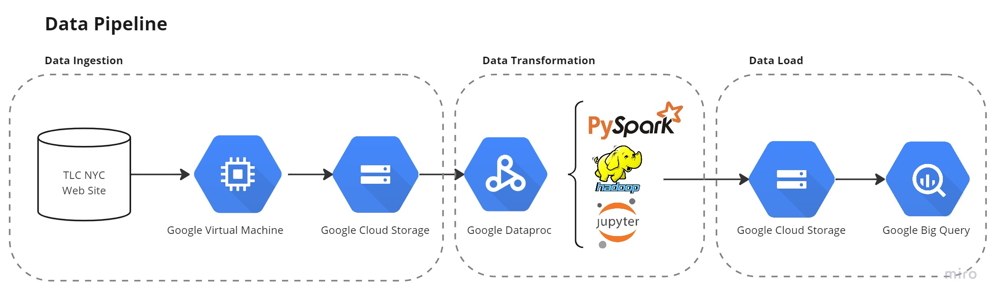

# Pipeline Description

Following, is the data pipeline diagram, highlighting the tools and technologies implemented:

## 1. Pipeline Platform

The present pipeline was built in the Google Cloud Platform (GCP), and we present some of the reasons to choose it.

### 1.1. Why a Cloud Platform?

Keeping in mind the actual status of data pipelines, when smaller to larger companies migrate their data to the cloud, avoiding physical servers issues and costs, developing this pipeline in a data cloud provider sounds great.

Besides all of this, a cloud platform could bring some advantages to the execution of the pipeline. For example, the computational power, which even with smaller datasets could be a problem in personal laptops. In the cloud, the possibility to create virtual machines and run the code from them solve this issue.

In addition, the cloud platforms (AWS, MS Azure, GCP, etc.) already have some out-of-the-box solutions for dealing with data.

### 1.2. Why Google Cloud Platform?

The reason to select GCP is mainly based on the resources and features available on the free trial, since we could use a lot of tools for a nice period without additional cost, this provider was the best choice.

Therefore, the good documentation and also online tutorials perform a key topics in the decision.

## 2. Pipeline Steps

The pipeline was created based on the ETL - Extract, Transform, and Load, process. So, keeping these steps in mind, we select the most appropriate GCP solutions and tools to implement in each one.

### 2.1. Data Ingestion

In order to extract the data (data ingestion), we use a GCP Virtual Machine Instance (VM). There are some benefits to doing it, such as download velocity and leaving the data away from the local machine, avoiding free space in hard-disk problems.

So, using a python code for generating the download links (available on the notebooks folder), the data was downloaded to the GCP VM.

### 2.2. Data Storage

In this step, we select the Google Cloud Storage (GCS) tool, a web service from Google focused on data storage. The main pro of using this service is the integration with the whole GCP environment, so we can easily export the data from the VM to GCS using the `gsutil` library.

We structure the data in folders by category, as follows:

├── tlc-data

│   ├── yellow-taxi

│   ├── green-taxi

│   ├── fhv

│   ├── fhvhv

### 2.3. Data Transformation

#### 2.3.1. Google Dataproc

To perform the data transformation step we select the Google Dataproc on GCP, a fully managed and highly scalable service for running Apache Hadoop, Apache Spark, and 30+ open-source tools and frameworks. 

The justification for this decision is based on the focus on Hadoop and Spark, great tools to implement in Big Data problems, as well as tools that have a great match with delta lake, one of the requirements from the Data Science team.

#### 2.3.2. Jupyter Notebook & PySpark

In the Dataproc tool, we create a Hadoop cluster, and, inside it, we could access some web interface tools. In order to perform the data transformation steps we select Jupyter Notebook and open a PySpark environment on it.

The selection of Jupyter is based on the facility to visualize operations and queries when dealing with data. For PySpark, the reasons for selection are based on the velocity for dealing with Big Data, as well the good fit with the python language and Jupyter Interface, besides the requirement for Delta Lake format.

Inside the Dataproc cluster, we run Hadoop version 3.2, and Spark 3.1, in a Debian 10 system.

#### 2.3.3. Transformation Methods

Using Jupyter with PySpark environment, we applied some general transformations to the datasets. Checking for inconsistency in the data format, filtering columns, and dropping invalid rows values.

In order to assess the data, the data dictionaries provided by TLC NYC Trip data were very useful.

Each transformation method applied in each dataset is better described in the Jupyter Notebooks files (please check them). As well, the final schema for each data category could be checked in their markdown file.

### 2.4. Load Data

To load the data, writing from the Jupyter Notebooks, we must have to meet the Data Science team requirements:

- Colum-oriented dataset in a Delta Lake format
- Row-oriented dataset

### 2.4.1 Output Folders - Google Cloud Storage (GCS)

Regardless of the data format, the first step in the load process will be to export the transformed dataset to the Google Cloud Storage (GSC) service.

Since we are running the transformation inside the GCP, this step is easily implemented by using the `gsutil` library. We organize the output folder in a similar way as the input, one folder per category, but now also one subfolder per oriented type.

#### 2.4.2. Colum-oriented Format

Running the PySpark inside the Dataproc cluster on GCP, we had problems with the Delta Lake installation, leading to issues when saving the data in a Delta Table format.

To workaround this situation, we select a column-oriented database tool on GCP, Google BigQuery. Unfortunately, we also run with problems saving the FHV and the Yellow Trip dataset in this format, only achieving good results for the Green Trip and the FHVHV datasets.

#### 2.4.3. Google BigQuery

With Google BigQuery, we achieve were able to import data from the Google Cloud Storage inside a Big Query Table, where the Data Science team could quickly run queries.

#### 2.4.4. Row-oriented Format

We face the same saving problem here, to save the output in a row-oriented database we select the `.csv` format after importing into a SQL DBMS, such as MySQL, PostgreSQL, or even Google Cloud SQL. But, unfortunately, a versioning problem only allowed us to save the Green Trip and the FHVHV datasets.

#### 2.4.3. Google Cloud Storage & Google BigQuery

Facing these challanges, we select the Goog,r, we achieve the result of automatically importing data from the Google Cloud Storage inside a Big Query Table, where the Data Science team could quickly run queries.

