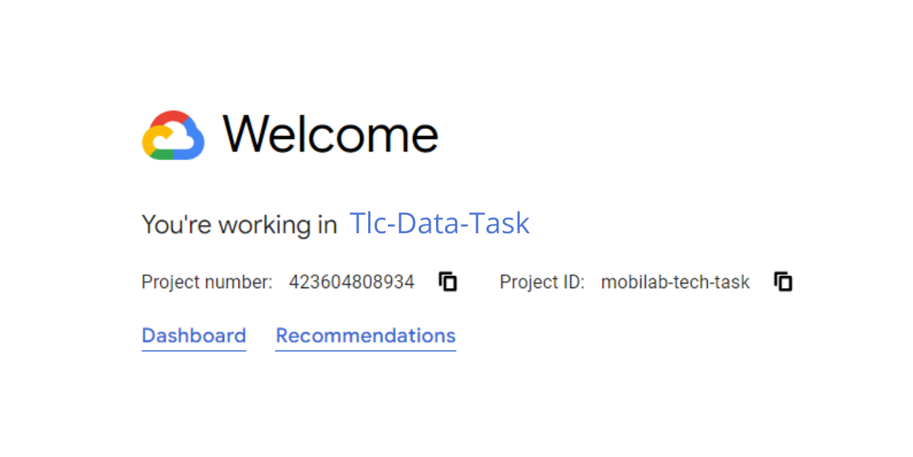
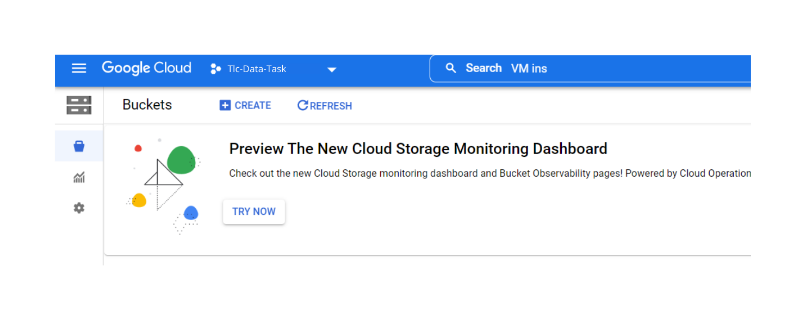
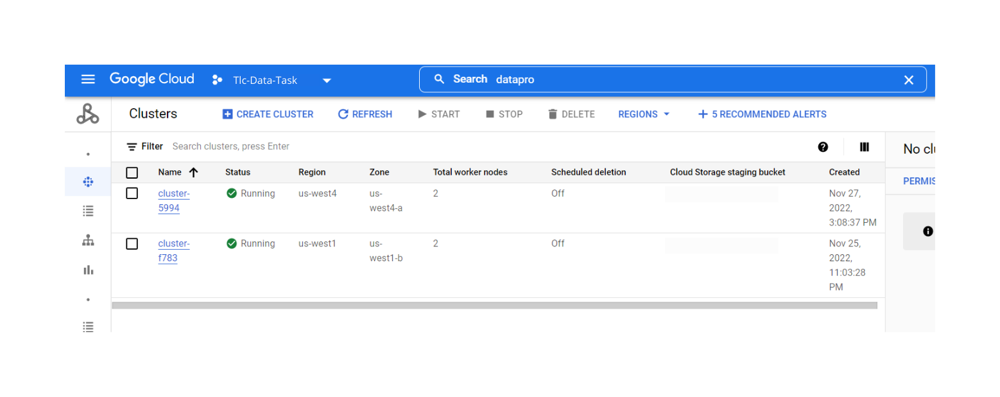
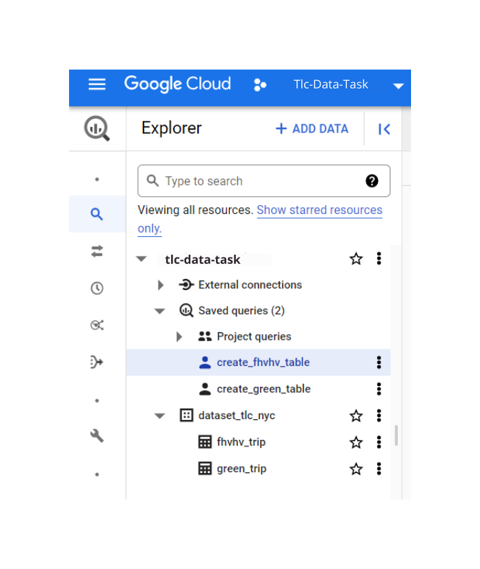
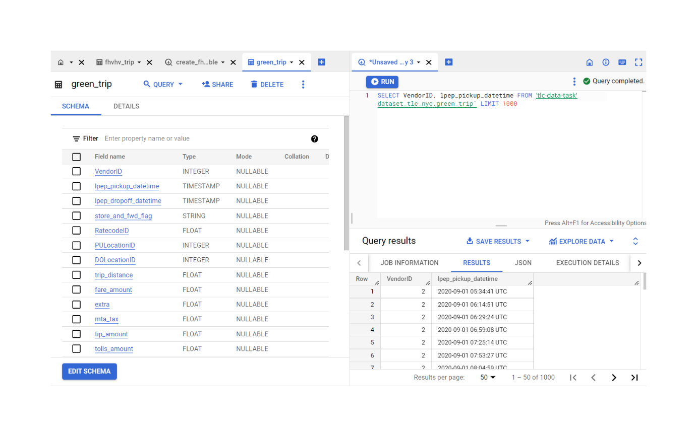

# Pipeline Instructions

In this file, we will cover the instructions in order to set up the pipeline.

## Step 1. Create a Google Cloud Project

1.1 In your Google Cloud Account, start a new project.

## Step 2. Set up a VM Instance Inside GCP

2.1 Inside this Google Project, go to Compute Engine.
2.2. Click on create an instance and fill the fields properly.

2.3 Open the VM terminal and make sure to have the `wget` and `gsutil` dependencies

## Step 3. Create the Google Cloud Storage Bucket and Load the Data

3.1 Open a new bucket in the Google Cloud Storage to load the raw datasets, the name is specified on the `Data_Ingestion_TLC_NYC` notebook

3.2 The new bucket must have the following structure:

├── tlc-data

│   ├── yellow-taxi

│   ├── green-taxi

│   ├── fhv

│   ├── fhvhv

3.2 In the VM terminal, run to commands generated by the `Data_Ingestion_TLC_NYC` notebook for each dataset

## Step 4. Create a Hadoop Cluster with Jupyter Interface

4.1 In the GCP, go to `dataproc` and start the process to create a new cluster

4.2 Select the most recent Hadoop and spark version
4.3 Make sure to select the options to run Jupyter Notebook as an interface
4.4. Synchronize the cluster with the previously created bucket, to be able to access your data

## Step 5. Run Jupyter Notebook Inside the Cluster

5.1 Open the cluster and go to a web interface, select the Jupyter Notebook option
5.2 With the Jupyter web interface you could save and load all the files quickly from the GCS

5.4 Now you could upload the notebooks on the GCS and open them in the Jupyter interface

## Step 6. Run the Notebooks

6.1 Inside the Jupyter notebook interface, just run each notebook to extract, transform, and load the data
6.2 After, you should be able to access the data via GCS

## Step 7. Load the Data to BigQuery

7.1 In the BigQuery page, create a dataset with the name `dataset_tlc_nyc`
7.2 Run the following query to create a new BigQuery table for the Green Taxi Trip data:

~~~~
CREATE EXTERNAL TABLE tlc-data.dataset_tlc_nyc.green_trip``
WITH PARTITION COLUMNS
OPTIONS (
format = 'PARQUET',
uris = ['gs://tlc-data-bucket/outputs/green_trip/parquet/*'],
hive_partition_uri_prefix = 'gs://tlc-data-bucket/outputs/green_trip/parquet',
require_hive_partition_filter = false);
~~~~

7.3 Run the following query to create a new BigQuery table for the FHVHV Trip data:

~~~~
CREATE EXTERNAL TABLE tlc-data.dataset_tlc_nyc.fhvhv_trip
WITH PARTITION COLUMNS
OPTIONS (
format = 'PARQUET',
uris = ['gs://tlc-data-bucket/outputs/fhvhv/parquet/*'],
hive_partition_uri_prefix = 'gs://tlc-data-bucket/outputs/fhvhv/parquet',
require_hive_partition_filter = false);
~~~~

7.3 After, you will end with a structure similar to this this

**Obs.:** Inside the BigQuery, you and your Data Science team could easily query the data in a very fast and efficient colum-oriented database

## You are end with the pipeline!

